# Previews

---

### Alma Linux

> 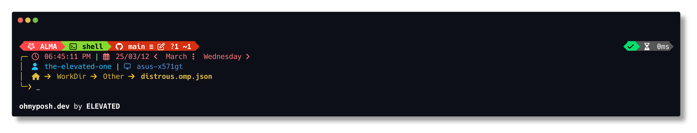

**Link to file:** [distrous-alma-linux.omp.json](themes/distrous-alma-linux.omp.json)

    
Extra

- **General**
        
    > 

- **Root**

    > 

- **Unwritable Directory**

    > 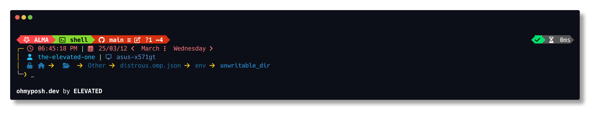

- **Python**

    - **Script**

        > 

    - **Venv**

        > 

    
### Alpine Linux

> 

**Link to file:** [distrous-alpine-linux.omp.json](themes/distrous-alpine-linux.omp.json)

    
Extra

- **General**
        
    > 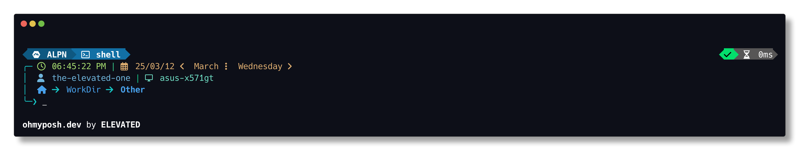

- **Root**

    > 

- **Unwritable Directory**

    > 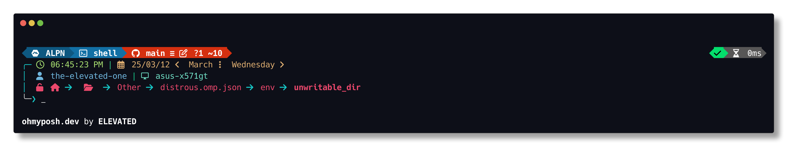

- **Python**

    - **Script**

        > 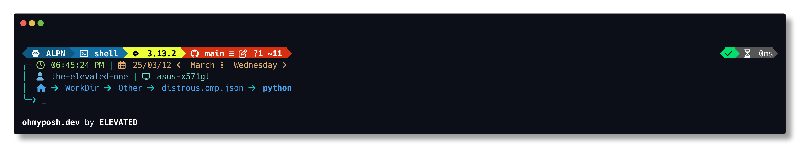

    - **Venv**

        > 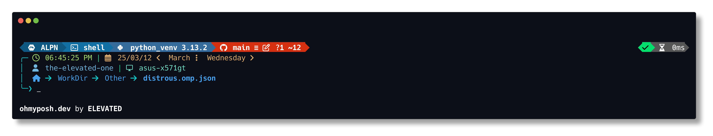

    
### Android

> 

**Link to file:** [distrous-android.omp.json](themes/distrous-android.omp.json)

    
Extra

- **General**
        
    > 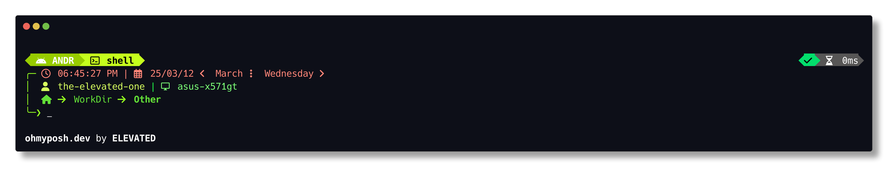

- **Root**

    > 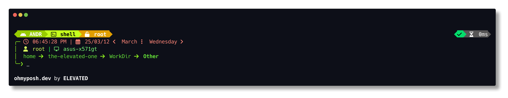

- **Unwritable Directory**

    > 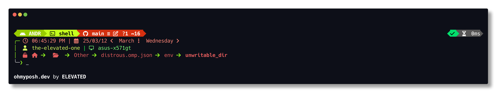

- **Python**

    - **Script**

        > 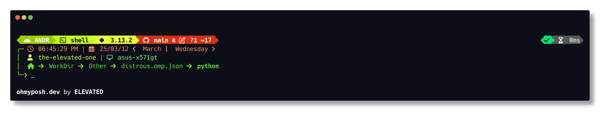

    - **Venv**

        > 

    
### AOSC Linux

> 

**Link to file:** [distrous-aosc-linux.omp.json](themes/distrous-aosc-linux.omp.json)

    
Extra

- **General**
        
    > 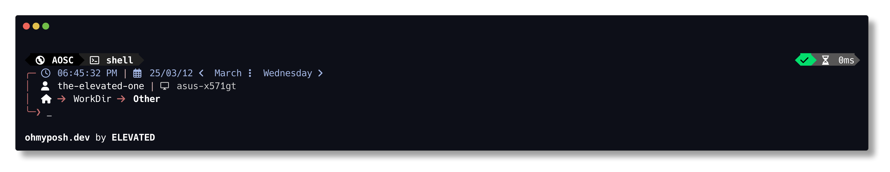

- **Root**

    > 

- **Unwritable Directory**

    > 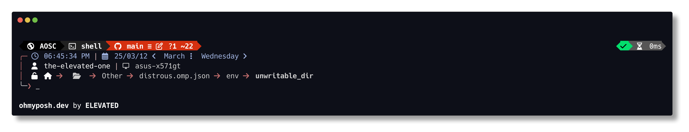

- **Python**

    - **Script**

        > 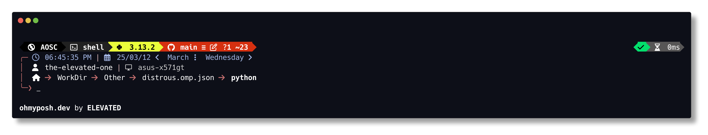

    - **Venv**

        > 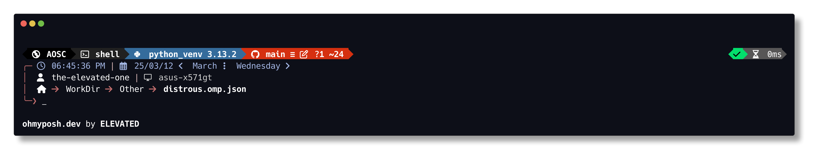

    
### Arch Linux

> 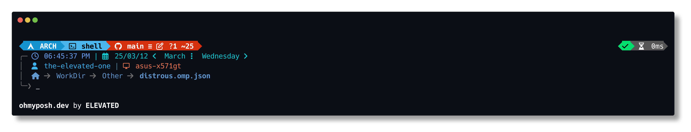

**Link to file:** [distrous-arch-linux.omp.json](themes/distrous-arch-linux.omp.json)

    
Extra

- **General**
        
    > 

- **Root**

    > 

- **Unwritable Directory**

    > 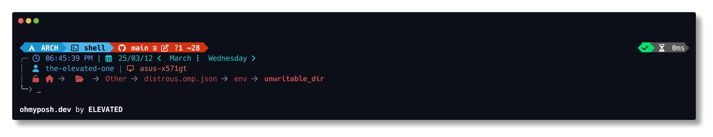

- **Python**

    - **Script**

        > 

    - **Venv**

        > 

    
### CentOS

> 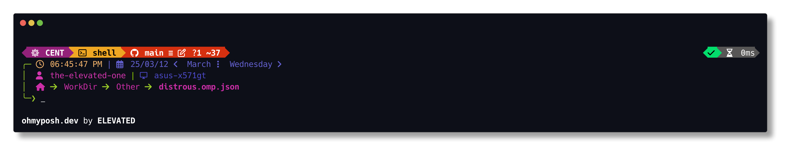

**Link to file:** [distrous-centos.omp.json](themes/distrous-centos.omp.json)

    
Extra

- **General**
        
    > 

- **Root**

    > 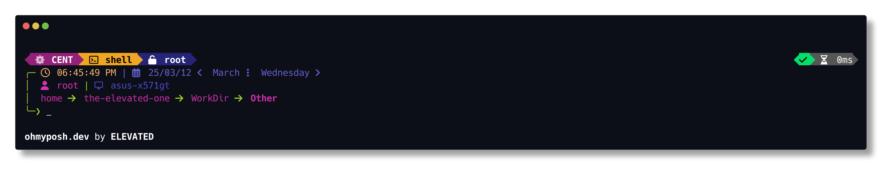

- **Unwritable Directory**

    > 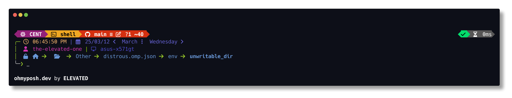

- **Python**

    - **Script**

        > 

    - **Venv**

        > 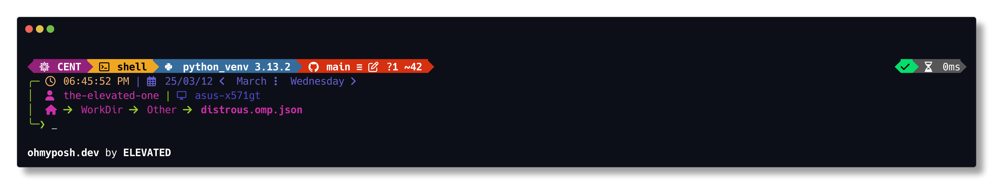

    
### CoreOS

> 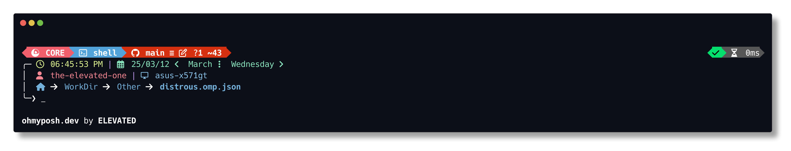

**Link to file:** [distrous-coreos.omp.json](themes/distrous-coreos.omp.json)

    
Extra

- **General**
        
    > 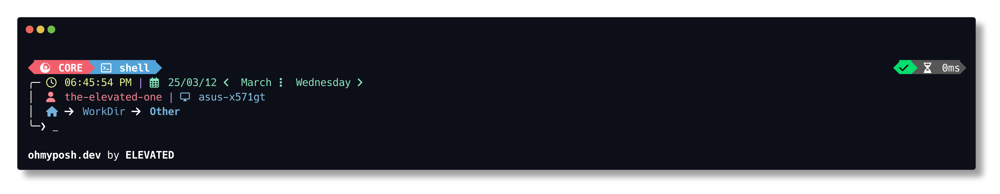

- **Root**

    > 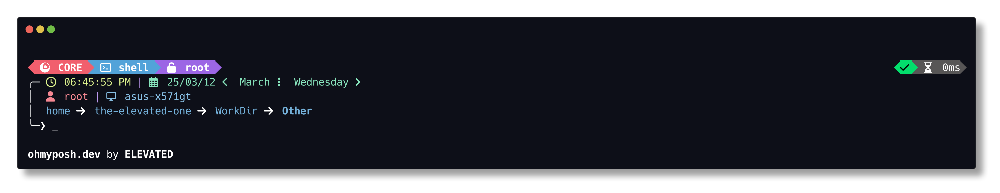

- **Unwritable Directory**

    > 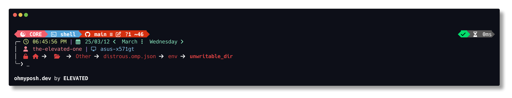

- **Python**

    - **Script**

        > 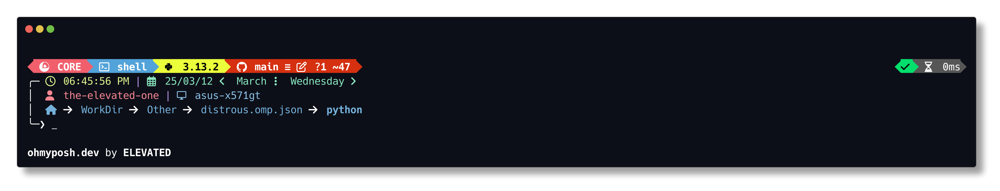

    - **Venv**

        > 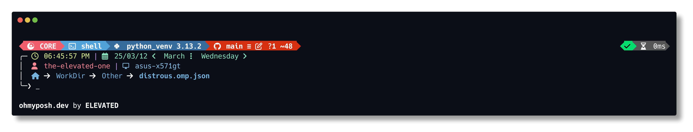

    
### Debian

> 

**Link to file:** [distrous-debian.omp.json](themes/distrous-debian.omp.json)

    
Extra

- **General**
        
    > 

- **Root**

    > 

- **Unwritable Directory**

    > 

- **Python**

    - **Script**

        > 

    - **Venv**

        > 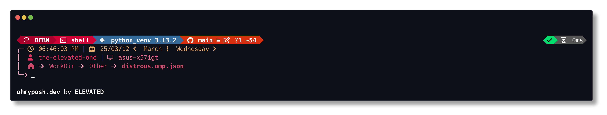

    
### Deepin

> 

**Link to file:** [distrous-deepin.omp.json](themes/distrous-deepin.omp.json)

    
Extra

- **General**
        
    > 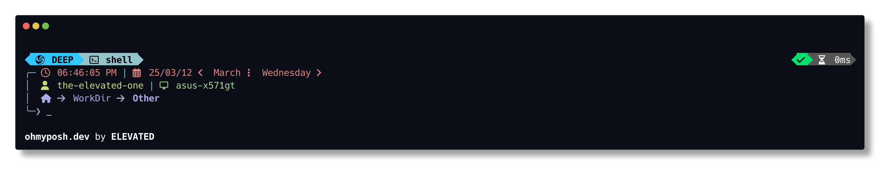

- **Root**

    > 

- **Unwritable Directory**

    > 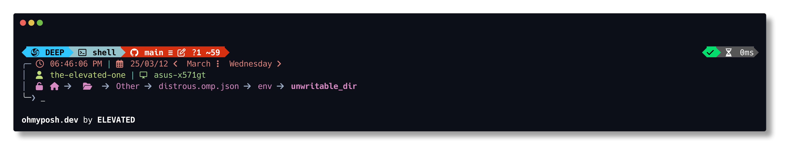

- **Python**

    - **Script**

        > 

    - **Venv**

        > 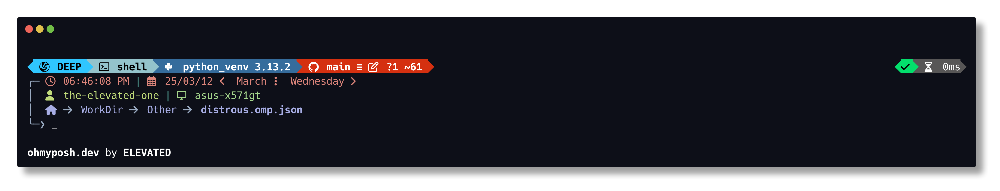

    
### Devuan

> 

**Link to file:** [distrous-devuan.omp.json](themes/distrous-devuan.omp.json)

    
Extra

- **General**
        
    > 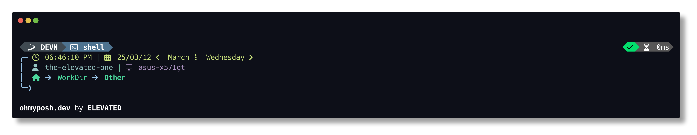

- **Root**

    > 

- **Unwritable Directory**

    > 

- **Python**

    - **Script**

        > 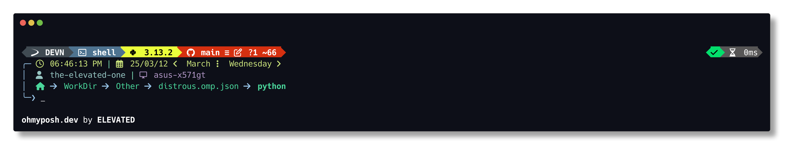

    - **Venv**

        > 

    
### ElementaryOS

> 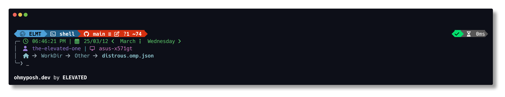

**Link to file:** [distrous-elementaryos.omp.json](themes/distrous-elementaryos.omp.json)

    
Extra

- **General**
        
    > 

- **Root**

    > 

- **Unwritable Directory**

    > 

- **Python**

    - **Script**

        > 

    - **Venv**

        > 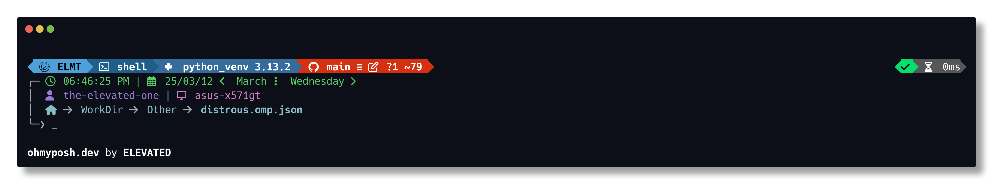

    
### EndeavourOS

> 

**Link to file:** [distrous-endeavouros.omp.json](themes/distrous-endeavouros.omp.json)

    
Extra

- **General**
        
    > 

- **Root**

    > 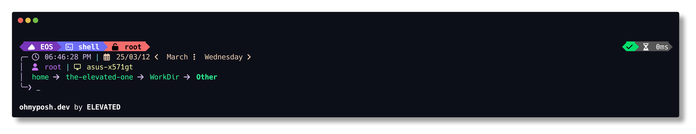

- **Unwritable Directory**

    > 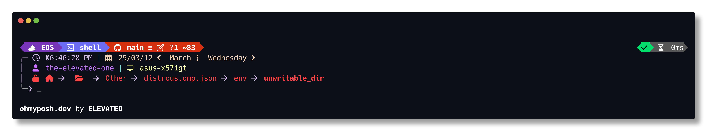

- **Python**

    - **Script**

        > 

    - **Venv**

        > 

    
### Fedora

> 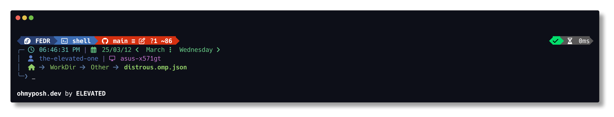

**Link to file:** [distrous-fedora.omp.json](themes/distrous-fedora.omp.json)

    
Extra

- **General**
        
    > 

- **Root**

    > 

- **Unwritable Directory**

    > 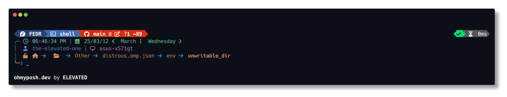

- **Python**

    - **Script**

        > 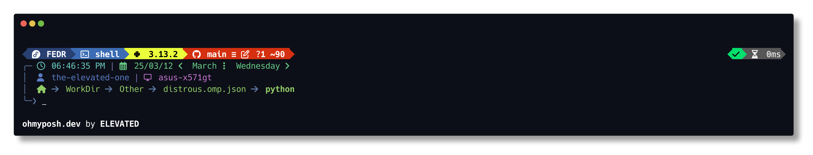

    - **Venv**

        > 

    
### Gentoo

> 

**Link to file:** [distrous-gentoo.omp.json](themes/distrous-gentoo.omp.json)

    
Extra

- **General**
        
    > 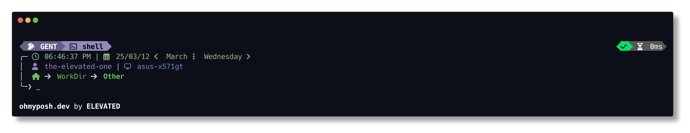

- **Root**

    > 

- **Unwritable Directory**

    > 

- **Python**

    - **Script**

        > 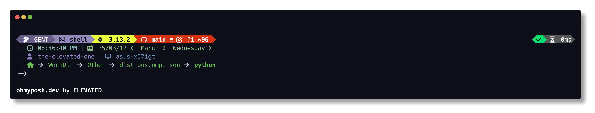

    - **Venv**

        > 

    
### Mageia

> 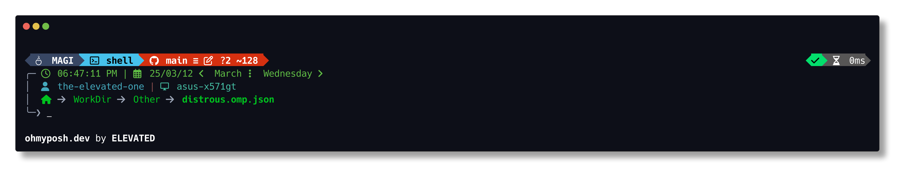

**Link to file:** [distrous-mageia.omp.json](themes/distrous-mageia.omp.json)

    
Extra

- **General**
        
    > 

- **Root**

    > 

- **Unwritable Directory**

    > 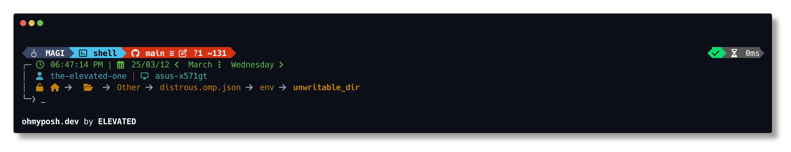

- **Python**

    - **Script**

        > 

    - **Venv**

        > 

    
### Manjaro

> 

**Link to file:** [distrous-manjaro.omp.json](themes/distrous-manjaro.omp.json)

    
Extra

- **General**
        
    > 

- **Root**

    > 

- **Unwritable Directory**

    > 

- **Python**

    - **Script**

        > 

    - **Venv**

        > 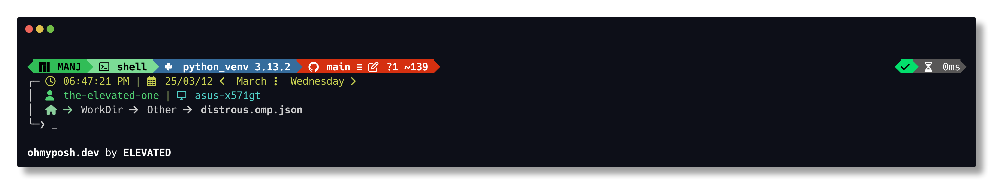

    
### Linux Mint

> 

**Link to file:** [distrous-linux-mint.omp.json](themes/distrous-linux-mint.omp.json)

    
Extra

- **General**
        
    > 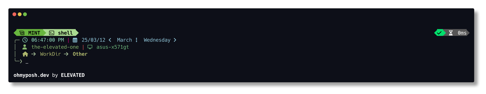

- **Root**

    > 

- **Unwritable Directory**

    > 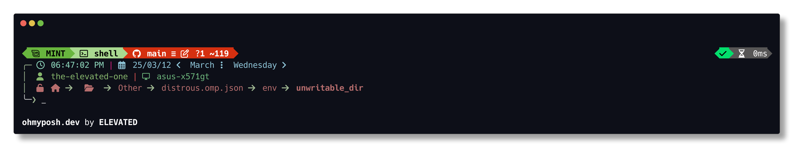

- **Python**

    - **Script**

        > 

    - **Venv**

        > 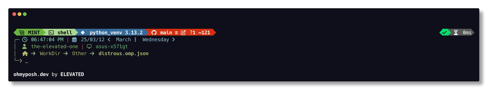

    
### NixOS

> 

**Link to file:** [distrous-nixos.omp.json](themes/distrous-nixos.omp.json)

    
Extra

- **General**
        
    > 

- **Root**

    > 

- **Unwritable Directory**

    > 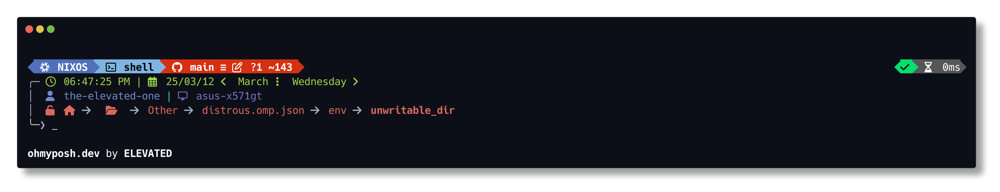

- **Python**

    - **Script**

        > 

    - **Venv**

        > 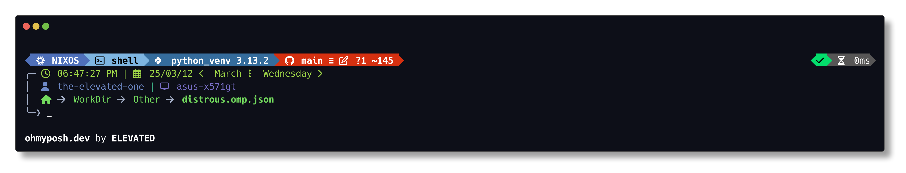

    
### OpenSUSE

> 

**Link to file:** [distrous-opensuse.omp.json](themes/distrous-opensuse.omp.json)

    
Extra

- **General**
        
    > 

- **Root**

    > 

- **Unwritable Directory**

    > 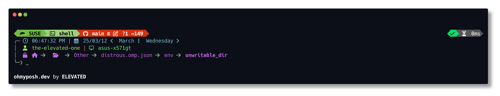

- **Python**

    - **Script**

        > 

    - **Venv**

        > 

    
### Tumbleweed

> 

**Link to file:** [distrous-tumbleweed.omp.json](themes/distrous-tumbleweed.omp.json)

    
Extra

- **General**
        
    > 

- **Root**

    > 

- **Unwritable Directory**

    > 

- **Python**

    - **Script**

        > 

    - **Venv**

        > 

    
### Raspbian

> 

**Link to file:** [distrous-raspbian.omp.json](themes/distrous-raspbian.omp.json)

    
Extra

- **General**
        
    > 

- **Root**

    > 

- **Unwritable Directory**

    > 

- **Python**

    - **Script**

        > 

    - **Venv**

        > 

    
### Red Hat

> 

**Link to file:** [distrous-red-hat.omp.json](themes/distrous-red-hat.omp.json)

    
Extra

- **General**
        
    > 

- **Root**

    > 

- **Unwritable Directory**

    > 

- **Python**

    - **Script**

        > 

    - **Venv**

        > 

    
### Rocky Linux

> 

**Link to file:** [distrous-rocky-linux.omp.json](themes/distrous-rocky-linux.omp.json)

    
Extra

- **General**
        
    > 

- **Root**

    > 

- **Unwritable Directory**

    > 

- **Python**

    - **Script**

        > 

    - **Venv**

        > 

    
### Slackware

> 

**Link to file:** [distrous-slackware.omp.json](themes/distrous-slackware.omp.json)

    
Extra

- **General**
        
    > 

- **Root**

    > 

- **Unwritable Directory**

    > 

- **Python**

    - **Script**

        > 

    - **Venv**

        > 

    
### Ubuntu

> 

**Link to file:** [distrous-ubuntu.omp.json](themes/distrous-ubuntu.omp.json)

    
Extra

- **General**
        
    > 

- **Root**

    > 

- **Unwritable Directory**

    > 

- **Python**

    - **Script**

        > 

    - **Venv**

        > 

    
### Kubuntu

> 

**Link to file:** [distrous-kubuntu.omp.json](themes/distrous-kubuntu.omp.json)

    
Extra

- **General**
        
    > 

- **Root**

    > 

- **Unwritable Directory**

    > 

- **Python**

    - **Script**

        > 

    - **Venv**

        > 

    
### Pop!_OS

> 

**Link to file:** [distrous-pop_os.omp.json](themes/distrous-pop_os.omp.json)

    
Extra

- **General**
        
    > 

- **Root**

    > 

- **Unwritable Directory**

    > 

- **Python**

    - **Script**

        > 

    - **Venv**

        > 

    
### Windows 10

> 

**Link to file:** [distrous-windows-10.omp.json](themes/distrous-windows-10.omp.json)

    
Extra

- **General**
        
    > 

- **Root**

    > 

- **Unwritable Directory**

    > 

- **Python**

    - **Script**

        > 

    - **Venv**

        > 

    
### Windows 11

> 

**Link to file:** [distrous-windows-11.omp.json](themes/distrous-windows-11.omp.json)

    
Extra

- **General**
        
    > 

- **Root**

    > 

- **Unwritable Directory**

    > 

- **Python**

    - **Script**

        > 

    - **Venv**

        > 

    
### KDE Neon

> 

**Link to file:** [distrous-kde-neon.omp.json](themes/distrous-kde-neon.omp.json)

    
Extra

- **General**
        
    > 

- **Root**

    > 

- **Unwritable Directory**

    > 

- **Python**

    - **Script**

        > 

    - **Venv**

        > 

    
### Docker

> 

**Link to file:** [distrous-docker.omp.json](themes/distrous-docker.omp.json)

    
Extra

- **General**
        
    > 

- **Root**

    > 

- **Unwritable Directory**

    > 

- **Python**

    - **Script**

        > 

    - **Venv**

        > 

    
### Kali Linux

> 

**Link to file:** [distrous-kali-linux.omp.json](themes/distrous-kali-linux.omp.json)

    
Extra

- **General**
        
    > 

- **Root**

    > 

- **Unwritable Directory**

    > 

- **Python**

    - **Script**

        > 

    - **Venv**

        > 

    
### CachyOS

> 

**Link to file:** [distrous-cachyos.omp.json](themes/distrous-cachyos.omp.json)

    
Extra

- **General**
        
    > 

- **Root**

    > 

- **Unwritable Directory**

    > 

- **Python**

    - **Script**

        > 

    - **Venv**

        > 

    
### Linux

> 

**Link to file:** [distrous-linux.omp.json](themes/distrous-linux.omp.json)

    
Extra

- **General**
        
    > 

- **Root**

    > 

- **Unwritable Directory**

    > 

- **Python**

    - **Script**

        > 

    - **Venv**

        > 

    
### Xero Linux

> 

**Link to file:** [distrous-xero-linux.omp.json](themes/distrous-xero-linux.omp.json)

    
Extra

- **General**
        
    > 

- **Root**

    > 

- **Unwritable Directory**

    > 

- **Python**

    - **Script**

        > 

    - **Venv**

        > 

    