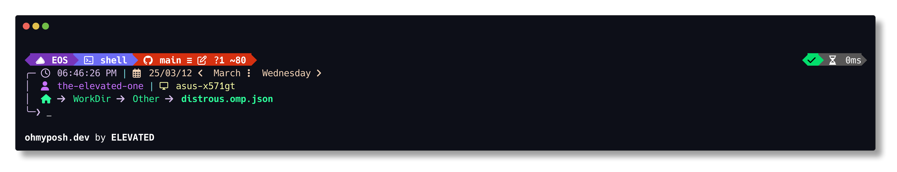
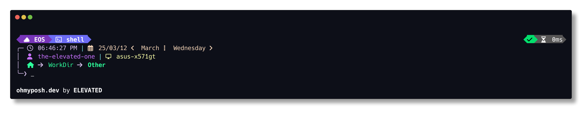
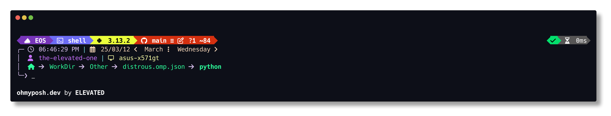
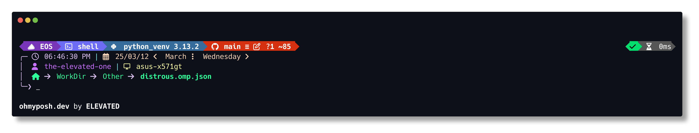

# distrous.omp.json


### [**OhMyPosh**](https://ohmyposh.dev/) Theme with Distro-based Color schemes

#### Based on [kushal.omp.json](https://github.com/JanDeDobbeleer/oh-my-posh/blob/main/themes/kushal.omp.json)

#### Uses [bash_progress_bar](https://github.com/pollev/bash_progress_bar) by pollev because why not xd

---

## Navigation

- [**Preview**](#preview)
- [**Distros**](#distros)
- [**Documentation**](#documentation)
- [***Additional Information***](#additional-information)

---

## Preview

### Previews for All Themes Here: [<ins>PREVIEWS.md</ins>](PREVIEWS.md)

### EndeavourOS - Example

> 

**Link to file:** [distrous-endeavouros.omp.json](themes/distrous-endeavouros.omp.json)

<details>
    <summary>Extra</summary>

- **General**

    > 

- **Root**

    > 

- **Unwritable Directory**

    > 

- **Python**

  - **Script**

        > 

  - **Venv**

        > 

</details>

---

## Distros

> If you want a distro added, create an ***enhancement*** issue.
> You may just say the name, or create a whole config part.
> You can find the ***Example*** config in the Documentation section.

- [**Alma Linux**](PREVIEWS.md#alma-linux)
- [**Alpine Linux**](PREVIEWS.md#alpine-linux)
- [**Android**](PREVIEWS.md#android)
- [**AOSC Linux**](PREVIEWS.md#aosc-linux)
- [**Arch Linux**](PREVIEWS.md#arch-linux)
- [**CentOS**](PREVIEWS.md#centos)
- [**CoreOS**](PREVIEWS.md#coreos)
- [**Debian**](PREVIEWS.md#debian)
- [**Deepin**](PREVIEWS.md#deepin)
- [**Devuan**](PREVIEWS.md#devuan)
- [**ElementaryOS**](PREVIEWS.md#elementaryos)
- [**EndeavourOS**](PREVIEWS.md#endeavouros)
- [**Fedora**](PREVIEWS.md#fedora)
- [**Gentoo**](PREVIEWS.md#gentoo)
- [**Mageia**](PREVIEWS.md#mageia)
- [**Manjaro**](PREVIEWS.md#manjaro)
- [**Linux Mint**](PREVIEWS.md#linux-mint)
- [**NixOS**](PREVIEWS.md#nixos)
- [**OpenSUSE**](PREVIEWS.md#opensuse)
- [**Tumbleweed**](PREVIEWS.md#tumbleweed)
- [**Raspbian**](PREVIEWS.md#raspbian)
- [**Red Hat**](PREVIEWS.md#red-hat)
- [**Rocky Linux**](PREVIEWS.md#rocky-linux)
- [**Slackware**](PREVIEWS.md#slackware)
- [**Ubuntu**](PREVIEWS.md#ubuntu)
- [**Kubuntu**](PREVIEWS.md#kubuntu)
- [**Pop!_OS**](PREVIEWS.md#pop_os)
- [**Windows 10**](PREVIEWS.md#windows-10)
- [**Windows 11**](PREVIEWS.md#windows-11)
- [**KDE Neon**](PREVIEWS.md#kde-neon)
- [**Docker**](PREVIEWS.md#docker)
- [**Kali Linux**](PREVIEWS.md#kali-linux)
- [**Linux**](PREVIEWS.md#linux)

---

## Documentation

- [**How to Configure**](#how-to-configure)
- [**Bash Scripts**](#bash-scripts)
- [**Python Scripts**](#python-scripts)
- [**Config**](#config)

### How to Configure

1. Install `git, python3, oh-my-posh` and a text editor line `neovim`
2. ```git clone --recurse-submodules https://github.com/TheElevatedOne/distrous.omp.json.git && cd distrous.omp.json```
3. Configure

### Bash Scripts

#### `generate-all.sh`

- Generate themes from config, generate previews and generate markdown
- Runs `distrous.sh`, `gen-previews.sh`, `gen-readme.sh` in that order

#### `distrous.sh`

- Runs `python/distrous.py`

#### `gen-previews.sh`

- Generates all previews
  - **Basic** - in GitHub Repo Directory
  - ***General*** - `cd ..` from the Repo
  - ***Root*** - `sudo -s <command>` in `cd ..`
  - *Unwritable* - `cd ./env/unwritable_dir/`, which is a root owned directory
  - *Python Script* - `cd ./python/`,in the scripts directory
  - *Python Venv* - `source ./env/python_venv/bin/activate`, to show a general venv

#### `gen-readme.sh`

- Runs `python/gen-readme.py`

#### `git-push.sh "$@"`

- Adds all, Commits with a message in an argument, Pushes to Repo in one command
- To make it faster

### Python Scripts

#### `python/distrous.py`

- Loads config into a dictionary
- Generates themes from a template

#### `python/gen-readme.py`

- Loads a config for the names
- Has a template string for the previews
- Uses `templates/template-PREVIEWS.md` to generate `PREVIEWS.md`

### Config

```json
"EndeavourOS": {                # Theme Name
  "icon": "\uF322 EOS",         # NerdFont UTF and/or Inicials
  "prompt_arr": "#D6BEEB",      # Arrow leading from time to prompt
  "distro_bg": "#7735B9",       # Main Distro color
  "distro_fg": "#FFFFFF",       # Text Color to complement distro_bg
  "shell_bg": "#6C6CF5",        # Secondary distro color
  "shell_fg": "#FFFFFF",        # Text Color to complement shell_bg
  "root_bg": "#F46C6B",         # Tertiary distro color 
  "root_fg": "#000000",         # Text Color to complement root_bg
  "pipe": "#79DFE1",            # Pipe/Divider Color
  "time": "#D6BEEB",            # Time Color 
  "date": "#F2D3B6",            # Date Color 
  "user": "#C771FF",            # Username Color
  "host": "#FAFFA7",            # Hostname Color 
  "writable_dir": "#2DFF9B",    # User-owned Dir tree color
  "unwritable_dir": "#FF4444",  # Non-User-owned Dir tree color
  "generate": true              # If true, theme generates when running scripts; if false, theme is skipped
}
```

> Secondary and Tertiary colors do not need to be from distro.
> They can be created by you based on the distro color/s

---

## Additional Information

- The Font used in previews and the Logo is **Liberation Mono Nerd Font** [<ins>*NerdFonts.com Download*</ins>](https://github.com/ryanoasis/nerd-fonts/releases/download/v3.3.0/LiberationMono.zip)
- To show custom unicode icons you need a patched font from [nerdfonts.com](https://www.nerdfonts.com/font-downloads).
- I use Neovim and Gpick for editing the config and picking the color scheme

> 
